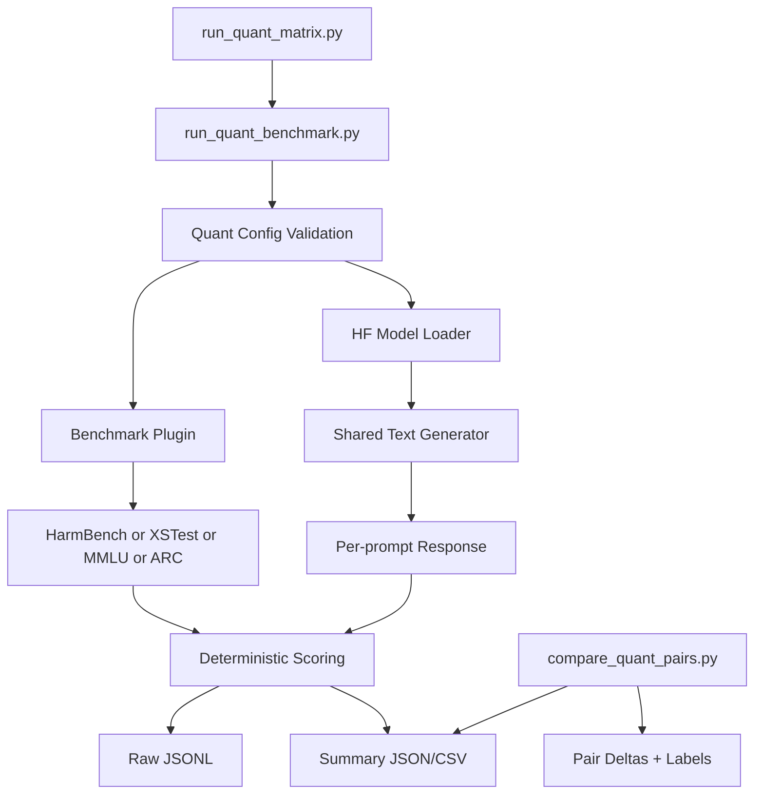

# Safety-Capability Trade-offs in Quantized Small Language Models

> **Coding agents:** read [`AGENTS.md`](AGENTS.md) (or [`CLAUDE.md`](CLAUDE.md) — they are duplicates) for the working conventions, then [`docs/PROJECT_LOG.md`](docs/PROJECT_LOG.md) for current state.

> **Current state (2026-06-18):** experimental study **complete** — 5 matched pairs / 10 models / 4 families, across 3 precisions (**fp16 → INT8 → NF4**), 4 benchmarks, scored primarily by the official HarmBench classifier (+ a gpt-4o second judge). 295 tests pass; `make agent-check` 8/8; full-repo scorer audit clean (PROJECT_LOG D36). Remaining work is non-research (supervisor email, report submission).

## Project Overview
This repository implements a research-grade benchmarking framework for a focused quantization study:

- harmful compliance under unsafe prompts
- over-refusal under benign prompts
- capability under general knowledge evaluation

The core objective is to compare baseline and quantized checkpoints as matched pairs (across **NF4 four-bit** and **INT8/LLM.int8** precisions), then analyze whether observed safety changes reflect true alignment shifts or capability degradation.

## Documentation

> **Start here:** [`docs/PROJECT_LOG.md`](docs/PROJECT_LOG.md) — single source of truth for current status, open tasks, decisions, and the changelog. Update this file whenever something changes; everything else listed below is permanent reference material that does not track day-to-day state.

**Start using / reusing it:**
- Quickstart & reuse guide: [`docs/QUICKSTART.md`](docs/QUICKSTART.md) — run your own study in 3 steps; extend to new models/benchmarks/precisions
- Reproducibility kit: [`docs/REPRODUCIBILITY.md`](docs/REPRODUCIBILITY.md) — mapped to the ML Reproducibility Checklist
- One-page results card: [`docs/RESULTS_CARD.md`](docs/RESULTS_CARD.md)

**Academic write-up:**
- Full FYP thesis (standalone Word document): `docs/FYP_Thesis_2026-06-18.docx` — build with `make thesis` (separate from the interim report)
- Workshop paper / poster outline: [`docs/paper_outline.md`](docs/paper_outline.md)
- Thesis structure & writing guide: [`docs/THESIS_OUTLINE.md`](docs/THESIS_OUTLINE.md)

**Permanent reference material:**
- Current FYP interim report: `docs/FYP_Report_2026-06-14.docx`
- Integrated agentic stack poster: `docs/architecture/fyp_quant_integrated_agentic_stack.svg`
- Visual repo hierarchy: `docs/architecture/fyp_quant_repo_hierarchy.svg`
- Visual agent harness architecture: `docs/architecture/fyp_quant_agent_harness_architecture.svg`
- Visual agentic architecture: `docs/architecture/fyp_quant_agentic_architecture.svg`
- Full FYP operational guide: `docs/FYP_REPO_GUIDE.md`
- TC1 cluster step-by-step runbook: `docs/TC1_CLUSTER_RUNBOOK.md`
- Quick start guide: `docs/USER_GUIDE.md`
- Methodology notes: `docs/methodology.md`
- Metric definitions: `docs/evaluation_metrics.md`
- Dataset notes: `docs/datasets.md`
- Limitations: `docs/limitations.md`
- Extensibility: `docs/extensibility.md`

**Archived (superseded; kept for traceability):** `docs/archive/`

## Study Focus
The framework is explicitly scoped to the following research questions:

- RQ1: Does 4-bit quantization increase harmful compliance?
- RQ2: Does 4-bit quantization increase over-refusal on benign prompts?
- RQ3: Does 4-bit quantization degrade general capability?
- RQ4: Are smaller models more sensitive than larger models within the same family?
- RQ5: Are effects consistent across model families?

## System Overview
The framework keeps model loading/generation modular, and refactors orchestration around quantization pair analysis.



## Repository Layout
```text
ethical_benchmark/
├── benchmarks/
│   ├── base.py
│   ├── harmbench.py
│   ├── xstest.py
│   ├── mmlu.py
│   └── registry.py
├── pipeline/
│   ├── run_quant_benchmark.py
│   └── run_quant_matrix.py
├── analysis/
│   └── compare_quant_pairs.py
├── cluster/
│   ├── generate_jobs.py
│   ├── submit_jobs.py
│   └── check_runs.py
├── models/
│   ├── loader.py
│   └── generation.py
└── quant/
    └── config_schema.py
```

Legacy toxicity/bias/factuality modules are retained as non-default paths for backward compatibility, but the default study flow is now quantization-focused.

## Model Matrix
Configured in `configs/default.yaml` (NF4 four-bit) and `configs/tc1_int8.yaml` (INT8 precision point). All five pairs are **run and folded into the report**:

- `Qwen/Qwen3-1.7B` (baseline + on-the-fly BNB NF4 4-bit + INT8)
- `Qwen/Qwen3-4B` (baseline + on-the-fly BNB NF4 4-bit + INT8)
- `meta-llama/Llama-3.2-3B-Instruct` (baseline + on-the-fly BNB NF4 4-bit + INT8)
- `mistralai/Mistral-7B-Instruct-v0.3` (baseline + on-the-fly BNB NF4 4-bit + INT8)
- `microsoft/Phi-4-mini-instruct` (baseline + on-the-fly BNB NF4 4-bit + INT8; `attn_implementation: eager`, native Phi3 load)

**Precisions:** each pair is evaluated at `fp16` (baseline), `NF4` (4-bit, the main study), and `INT8` (bitsandbytes LLM.int8 — a *separate method*, the §6.15 precision point, analysed by `scripts/precision_sweep_analysis.py` so it stays out of the base-vs-4bit pipeline). The `quant_method` field (default `nf4`; `int8` opt-in) selects the method.

Each model entry includes `family`, `size_b`, `quantized`, `pair_id`, `quant_method`, benchmark coverage, plus an optional `attn_implementation`.

## Benchmarks and Metrics
### Harmful Compliance: HarmBench
- Primary metric: `attack_success_rate`
- Additional outputs: harmful compliance count, safe refusal count, malformed output count
- Scoring method: **primary scorer is the official HarmBench classifier** (`cais/HarmBench-Llama-2-13b-cls`, judge; decision D16, run on TC1 job 61047), **cross-checked by a second independent judge (gpt-4o)** for robustness (κ 0.69–0.94; D25/D26). The deterministic v2 refusal regex is retained only as a *demoted secondary proxy* — it over-counts ASR. Judge labels live in redacted `scores.judge.{harmbench_cls,api_judge}.jsonl` / `summary.judge.*.json` sidecars; v2 in `scores.v2.jsonl` / `summary.v2.json`; the TC1-original `raw.jsonl` / `summary.json` are preserved unchanged.

### Over-refusal: XSTest
- Primary metric: `over_refusal_rate`
- Additional outputs: benign answer rate, malformed output count
- Scoring method: deterministic v2 refusal parser (the HarmBench classifier covers HarmBench only; a refusal-style judge for XSTest is future work)

### Capability: MMLU Subset + ARC-Challenge
- Primary metric: `accuracy` (exact match), on a 300-question MMLU subset (6 subjects)
- Second capability benchmark: **ARC-Challenge** (`allenai/ai2_arc`, 1,172 questions) added to corroborate the MMLU-based capability claims (T23/D29); direction-robust but shows the MMLU losses are partly MMLU-specific
- Additional outputs: answered rate and subject-level breakdown

## Quantization Analysis Outputs
`compare_quant_pairs.py` computes:

- baseline vs 4-bit deltas per `pair_id` (the INT8 precision sweep is computed separately by `scripts/precision_sweep_analysis.py`)
- absolute and relative deltas, with paired-bootstrap 95% CIs + McNemar exact tests
- Qwen compact-scale sensitivity (1.7B vs 4B delta magnitudes)
- cross-family sign consistency (all-pairs matrix across 4 families)
- a two-layer label + `evidence_status` (confirmed / directional / null) scheme; interpretation labels:
  - `alignment_degradation`
  - `alignment_improvement`
  - `capability_collapse_masquerading_as_safety`
  - `robust_preservation`
  - `broad_degradation`
  - `over_refusal_regression`

## Setup
```bash
python -m venv .venv
source .venv/bin/activate
pip install -r requirements.txt
```

## How to Run
### 1) One model x benchmark
```bash
python run_quant_benchmark.py \
  --config configs/default.yaml \
  --model qwen_2b_base \
  --benchmark harmbench \
  --output_dir results
```

### 2) Full matrix
```bash
python run_quant_matrix.py \
  --config configs/default.yaml \
  --output_dir results
```

### Easier unified CLI
```bash
python fyp_cli.py smoke
python fyp_cli.py matrix
python fyp_cli.py analyze
```

### Fast shortcut commands
```bash
make smoke
make matrix DEVICE=cuda
make analyze
make cluster-generate   # regenerate sbatch scripts (Mac only)
make cluster-check      # poll squeue for job status
# Note: do NOT use make cluster-submit on TC1 — use direct sbatch instead (see SLURM Workflow below)
```

### Agent harness commands
```bash
python fyp_cli.py agent-start --task T21 --agent fyp-report-auditor
python fyp_cli.py agent-status
make agent-check
make harness-eval
make agent-handoff
make agent-dashboard
make agent-tc1-checklist
```

The agent harness turns repo rules into checks: `configs/artifact_policy.yaml`
declares immutable raw artifacts, allowed sidecars, stale-text scans, redaction
scans, and report-worthy file patterns. `docs/agent_tasks/` holds bounded task
packets for future agents, and generated files such as `docs/HANDOFF.md`,
`docs/AGENT_DASHBOARD.md`, and `docs/TC1_AGENT_CHECKLIST.md` provide fresh
session recovery without replacing `docs/PROJECT_LOG.md`.

Agentic workflow helpers:
- Repo skills: `.agents/skills/`
- Codex custom subagents: `.codex/agents/`
- Codex hooks: `.codex/hooks.json` and `.codex/hooks/`
- Usage guide: `docs/AGENTIC_WORKFLOW.md`
- Integrated architecture poster: `docs/architecture/fyp_quant_integrated_agentic_stack.svg`
- Harness architecture visual: `docs/architecture/fyp_quant_agent_harness_architecture.svg`

### 3) Pairwise analysis
```bash
python compare_quant_pairs.py \
  --config configs/default.yaml \
  --results_dir results \
  --output_dir results/analysis
```

## SLURM Workflow (TC1)
Active sbatch scripts live in `slurm/jobs_tc1/` (NF4 matrix) and `slurm/jobs_tc1_smoke/` (5-sample smoke); the **INT8 precision point** has its own set under `slurm/jobs_tc1_int8/` + `slurm/jobs_tc1_int8_smoke/` (run with `configs/tc1_int8.yaml`), plus `slurm/judge_validation_int8.sbatch`. All are tracked in git — `git pull` on TC1 is sufficient to get them.

### Submit jobs (TC1 head node)
`make cluster-submit` is **not suitable for TC1**: it reads `manifest.json` (gitignored, absent after
`git pull`) and runs Python on the head node (TC1 policy forbids user code there). Use direct `sbatch`:
```bash
# Submit the current pair only. TC1 currently runs one GPU job at a time;
# the second job can queue with QOSMaxGRESPerUser until the first clears.
sbatch slurm/jobs_tc1/qwen_2b_base__matrix.sbatch
sbatch slurm/jobs_tc1/qwen_2b_4bit__matrix.sbatch
squeue -u utan001   # wait for both to finish, then next pair
sbatch slurm/jobs_tc1/qwen_4b_base__matrix.sbatch
sbatch slurm/jobs_tc1/qwen_4b_4bit__matrix.sbatch
squeue -u utan001
sbatch slurm/jobs_tc1/llama_3_2_3b_base__matrix.sbatch
sbatch slurm/jobs_tc1/llama_3_2_3b_4bit__matrix.sbatch
# T26 extension (run after the originals; smoke first, Mistral is HF-gated):
squeue -u utan001
sbatch slurm/jobs_tc1/mistral_7b_base__matrix.sbatch
sbatch slurm/jobs_tc1/mistral_7b_4bit__matrix.sbatch
squeue -u utan001
sbatch slurm/jobs_tc1/phi4_mini_base__matrix.sbatch
sbatch slurm/jobs_tc1/phi4_mini_4bit__matrix.sbatch
```

### Check run status
```bash
squeue -u utan001
seff <JOBID>
ls results/*/*/summary.json
```

## Output Structure
Results are organized by model and benchmark to simplify matched comparisons:

```text
results/
  qwen_2b_base/
    harmbench/
      raw.jsonl
      summary.json
      scores.v2.jsonl
      summary.v2.json
    xstest/
      raw.jsonl
      summary.json
      scores.v2.jsonl
      summary.v2.json
    mmlu/
      raw.jsonl
      summary.json
  qwen_2b_4bit/
  qwen_4b_base/
  qwen_4b_4bit/
  llama_3_2_3b_base/
  llama_3_2_3b_4bit/
  summary/
    harmbench_runs.csv
    xstest_runs.csv
    mmlu_runs.csv
  analysis/
    pairwise_deltas.json
    pairwise_deltas.csv
    pair_interpretations.json
    pair_interpretations.csv
    quantization_analysis_summary.json
```

The tree above shows the original pattern; the live `results/` also contains an `arc/` benchmark dir per model, the redacted HarmBench judge sidecars (`scores.judge.{harmbench_cls,api_judge}.jsonl` + `summary.judge.*.json`), the five `*_8bit/` INT8 model dirs, and the INT8 precision-sweep + scoped diagnostics under `analysis/` (`precision_sweep.{json,csv}`, `*_int8.{json,csv}`). The TC1-original `raw.jsonl` / `summary.json` are gitignored and hash-pinned in `results/raw_artifact_manifest.sha256`.

## Reproducibility Controls
- Fixed global seed
- Shared decoding configuration across all models
- Prompt-level resume logic via `prompt_id`
- Per-response raw logs for auditability
- Immutable raw-output contract: post-hoc scoring corrections and future judge validation write derived sidecars only; they do not overwrite `raw.jsonl` or `summary.json`.

## Current Headline Results (judge-primary, D16)

HarmBench ASR is scored by the **official HarmBench classifier** (`cais/HarmBench-Llama-2-13b-cls`), cross-checked by a gpt-4o second judge. The v2 refusal regex is a demoted secondary proxy only (it over-counts ASR).

### Main study — fp16 vs NF4 (4-bit), all 5 pairs

| Pair | HarmBench ASR (judge) | ΔASR (95% CI) | Sig? | Label |
|---|---:|---|:--:|---|
| qwen_2b | 0.135 → 0.190 | +0.055 [+0.010, +0.100] | **yes** | **broad_degradation** |
| qwen_4b | 0.065 → 0.090 | +0.025 [−0.000, +0.055] | no | alignment_degradation (directional) |
| llama_3_2_3b | 0.040 → 0.040 | 0.000 [−0.020, +0.020] | no | broad_degradation |
| mistral_7b | 0.385 → 0.345 | −0.040 [−0.110, +0.025] | no | alignment_improvement (directional) |
| phi4_mini | 0.055 → 0.055 | 0.000 [−0.030, +0.030] | no | robust_preservation |

Under the classifier, NF4 never *reduces* true harmful compliance, and **Qwen 1.7B is the only significant ΔASR** in the fp16-vs-NF4 comparison — a modest, borderline effect that is also judge-dependent (not significant under the gpt-4o judge) and attenuates under a multi-seed arm. It loses significant capability too (broad_degradation). The v2 proxy would have mislocated the significant effect on Qwen 4B; the judge relocated it to Qwen 1.7B (the study's central methodological finding).

### Precision point — fp16 → INT8 → NF4 (§6.15)

Adding INT8 (bitsandbytes LLM.int8) shows the quantization effect is **not a smooth function of bit-width**:
- **Capability** = a clean **cliff at 4-bit**: no INT8 MMLU/ARC delta is significant for any pair; the significant capability losses are all at NF4.
- **Safety** = **two-peaked**: the two significant ΔASR moves sit at *different* precisions — Qwen-1.7B @ NF4 (above) and **Llama-3B @ INT8 (+0.040)**, the latter significant under both judges + McNemar (p = 0.008/0.022) but non-monotonic (reverts at NF4) and small (≈8–9 prompts), so reported as a caveated, method-specific effect.

Significance flags are nominal/per-comparison (no family-wise correction; the Qwen-1.7B p = 0.027 would not survive strict Bonferroni — see report §6.5). A full-repo scorer audit (D36) confirmed every primary number is classifier-scored and nothing invalidates the results. See `docs/PROJECT_LOG.md` (D16/D23/D26/D32/D35/D36) and `docs/FYP_Report_2026-06-14.docx` (§6.12–§6.15) for the full audit trail.

## Documentation
- `docs/methodology.md`
- `docs/evaluation_metrics.md`
- `docs/datasets.md`
- `docs/limitations.md`
- `docs/extensibility.md`

## Mapping to FYP Report
- Chapter 1: Introduction -> README Overview
- Chapter 2: Related Work -> `docs/datasets.md`
- Chapter 3: Methodology -> `docs/methodology.md`
- Chapter 4: Experiments -> `docs/evaluation_metrics.md`
- Chapter 5: Limitations -> `docs/limitations.md`
