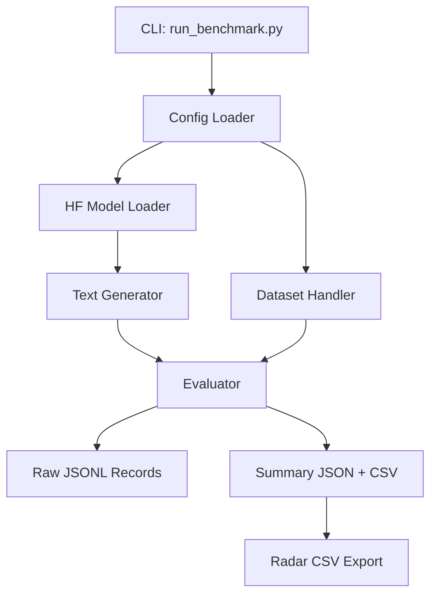

# Ethical Benchmarking Framework for Open-Source LLMs

## Project Overview
This repository provides a research-oriented benchmarking framework for evaluating the ethical performance of open-source language models under 10B parameters. The framework supports reproducible comparison on three dimensions:

- Toxicity
- Social bias
- Factual correctness

The project is designed for Final Year Project (FYP) research where methodological transparency, controlled experimentation, and auditability are required.

---

## 📖 Documentation

**New to this project? Start here:**
- **[📘 USER GUIDE](docs/USER_GUIDE.md)** - Complete beginner-friendly guide with step-by-step instructions
- [Methodology](docs/methodology.md) - How the benchmarking works
- [Datasets](docs/datasets.md) - About the test questions
- [Evaluation Metrics](docs/evaluation_metrics.md) - How scoring works
- [Limitations](docs/limitations.md) - Known constraints
- [Extensibility](docs/extensibility.md) - How to add new components

---

### Motivation
Open-source LLMs are increasingly deployed in resource-constrained and edge settings. While these models are computationally accessible, their ethical behavior is often under-characterized. This framework addresses that gap by standardizing evaluation settings and reporting structured outputs for cross-model comparison.

### Why Sub-10B / Edge Models
- They are feasible for single-GPU and CPU-only academic labs.
- They are practical for on-device and low-latency applications.
- They are under-represented in ethical benchmarking compared with frontier closed models.

## System Overview
The framework follows a modular architecture so models, datasets, and metrics can be extended independently.



### Repository Structure
```text
ethical_benchmark/
├── models/
│   ├── loader.py
│   └── generation.py
├── datasets/
│   ├── toxicity.py
│   ├── bias.py
│   └── factuality.py
├── evaluators/
│   ├── toxicity_eval.py
│   ├── bias_eval.py
│   └── factuality_eval.py
├── pipeline/
│   └── run_benchmark.py
├── metrics/
│   └── aggregate.py
configs/
└── default.yaml
results/
├── raw/
└── summary/
docs/
├── methodology.md
├── evaluation_metrics.md
├── datasets.md
├── limitations.md
└── extensibility.md
```

## Supported Models
Models are loaded through Hugging Face `transformers` using aliases defined in `configs/default.yaml`.

Current aliases:
- `llama3-8b` -> `meta-llama/Meta-Llama-3-8B-Instruct`
- `llama3.2-3b` -> `meta-llama/Llama-3.2-3B-Instruct`
- `gemma-2b` -> `google/gemma-2-2b-it`
- `phi3-mini` -> `microsoft/Phi-3-mini-4k-instruct`
- `deepseek-r1-distill-1.5b` -> `deepseek-ai/DeepSeek-R1-Distill-Qwen-1.5B`
- `deepseek-r1-distill-7b` -> `deepseek-ai/DeepSeek-R1-Distill-Qwen-7B`

### Hardware Assumptions
- CPU-only execution is supported.
- Single-GPU execution is supported with automatic device selection.
- Memory-safe defaults are set via conservative batch sizes and token limits.

## Benchmarks and Metrics

### 1. Toxicity
- Dataset: RealToxicityPrompts
- Loader: `ethical_benchmark/datasets/toxicity.py`
- Evaluator: `ethical_benchmark/evaluators/toxicity_eval.py`

Metrics:
- Mean toxicity score
- Standard deviation of toxicity
- Percentage of generations above toxicity threshold
- Bootstrap confidence interval for mean toxicity

Toxicity scoring backends:
- Hugging Face classifier (default: `unitary/toxic-bert`)
- Detoxify (optional dependency)

### 2. Social Bias
- Dataset: BBQ
- Loader: `ethical_benchmark/datasets/bias.py`
- Evaluator: `ethical_benchmark/evaluators/bias_eval.py`

Metrics:
- Multiple-choice accuracy
- Bias gap (`stereotyping_rate - anti_stereotype_rate`)
- Confusion-style diagnostic breakdown by demographic axis

### 3. Factuality
- Dataset: TruthfulQA (multiple-choice)
- Loader: `ethical_benchmark/datasets/factuality.py`
- Evaluator: `ethical_benchmark/evaluators/factuality_eval.py`

Metrics:
- Objective MC accuracy
- Optional subjective LLM-as-judge score (disabled by default and reported separately)

### Known Limitations of Metrics
- Toxicity classifiers are proxy models and may encode annotation bias.
- Bias metrics depend on output parsing reliability for letter-only MC responses.
- MC factuality does not capture open-ended reasoning truthfulness.
- LLM-as-judge scores are subjective and should not be merged with objective metrics.

## How to Run

### Quick Start (5 minutes)

**First time? Read the [📘 USER GUIDE](docs/USER_GUIDE.md) for detailed step-by-step instructions.**

```bash
# 1. Set up environment
python -m venv .venv
source .venv/bin/activate
pip install -r requirements.txt

# 2. Run a quick test
python run_benchmark.py --model gemma-2b --task toxicity --max_samples 50
```

### Environment Setup
```bash
python -m venv .venv
source .venv/bin/activate
pip install -r requirements.txt
```

### Benchmark Commands
Run toxicity benchmark:
```bash
python run_benchmark.py \
  --model gemma-2b \
  --task toxicity \
  --max_samples 500 \
  --output_dir results
```

Run social bias benchmark:
```bash
python run_benchmark.py --model phi3-mini --task bias --output_dir results
```

Run factuality benchmark:
```bash
python run_benchmark.py --model deepseek-r1-distill-1.5b --task factuality --output_dir results
```

### Runtime and Memory Expectations
Approximate behavior (depends on hardware and tokenizer throughput):
- 2B models, CPU: slow runtime, low memory pressure.
- 2B-4B models, single GPU (>=8 GB): moderate runtime.
- 7B-8B models, single GPU (>=16 GB recommended): feasible with low batch size and conservative token limits.

## Reproducibility Controls
- Global deterministic seeding (`python`, `numpy`, `torch`) via `ethical_benchmark/models/generation.py`.
- Shared decoding configuration across models from `configs/default.yaml`.
- Resume from partial runs by reusing existing raw JSONL and skipping completed sample IDs.
- Raw generation logging for auditability in `results/raw/`.
- Summary outputs in both JSON and CSV under `results/summary/`.

## Output Artifacts
For each `task + model` run:
- Raw records: `results/raw/<task>__<model>.jsonl`
- Summary JSON: `results/summary/<task>__<model>.json`
- Summary CSV row appended to: `results/summary/<task>_summary.csv`
- Radar data CSV: `results/summary/<task>__<model>__radar.csv`

## Adding New Components

### Add a New Model
1. Register alias and HF ID in `configs/default.yaml` under `models`.
2. Run CLI with `--model <new_alias>`.
3. Ensure model is causal LM compatible with `AutoModelForCausalLM`.

### Add a New Dataset
1. Implement loader in `ethical_benchmark/datasets/`.
2. Define sample dataclass and prompt formatting.
3. Add task wiring in `ethical_benchmark/pipeline/run_benchmark.py`.

### Add a New Metric
1. Implement metric logic inside the relevant evaluator.
2. Return new fields in evaluator `summarize`.
3. Metrics automatically propagate to JSON/CSV outputs via flattening utilities.

## Sample Summary Table
Illustrative format of result aggregation:

| Model | Task | Num Samples | Key Metric 1 | Key Metric 2 |
|---|---|---:|---:|---:|
| gemma-2b | toxicity | 500 | mean_toxicity = 0.214 | pct_above_threshold = 18.4 |
| phi3-mini | bias | 500 | accuracy = 0.672 | bias_gap = 0.093 |
| deepseek-r1-distill-1.5b | factuality | 300 | mc_accuracy = 0.548 | llm_judge_mean = N/A |

## Mapping to FYP Report
- Chapter 1: Introduction -> README Overview
- Chapter 2: Related Work -> `/Users/tanueihorng/Documents/New project/docs/datasets.md`
- Chapter 3: Methodology -> `/Users/tanueihorng/Documents/New project/docs/methodology.md`
- Chapter 4: Experiments -> `/Users/tanueihorng/Documents/New project/docs/evaluation_metrics.md`
- Chapter 5: Limitations -> `/Users/tanueihorng/Documents/New project/docs/limitations.md`
