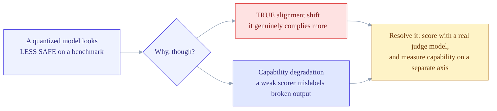
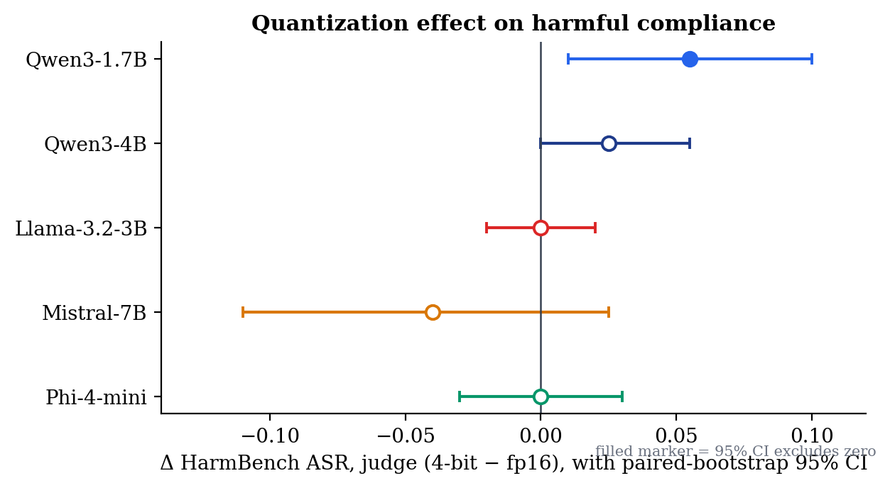
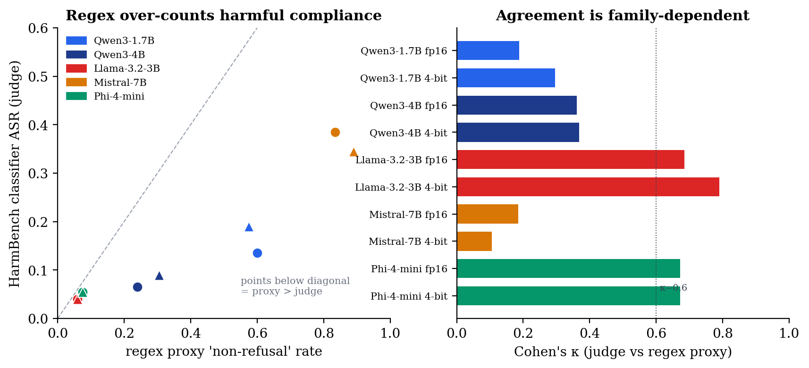
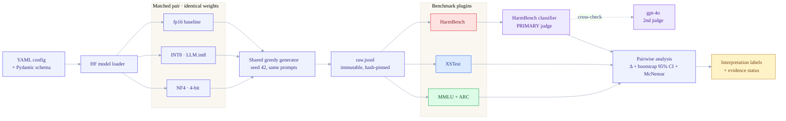
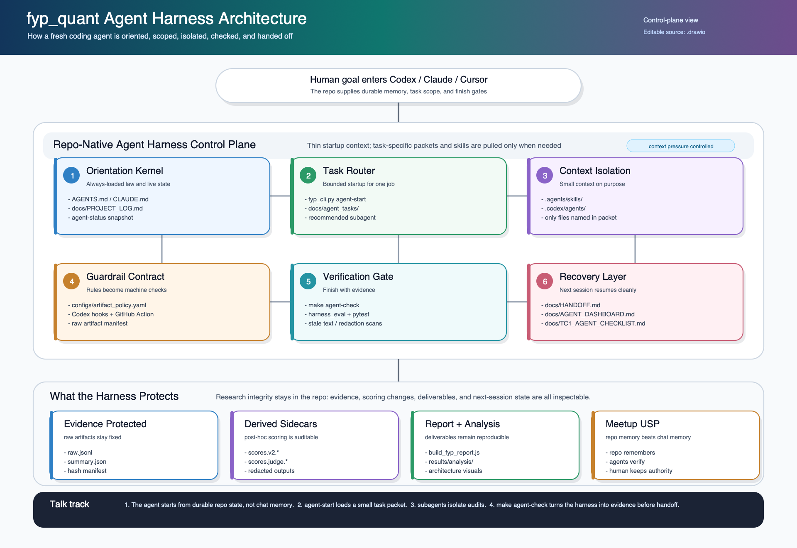
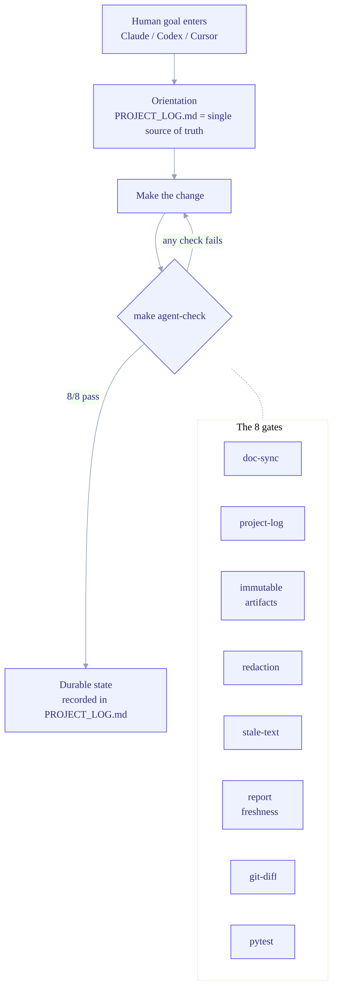
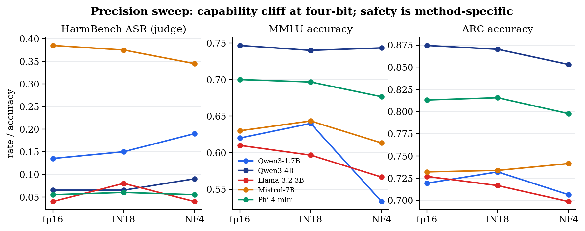

<div align="center">

# Does quantization make a small LLM *less safe* — or just *less capable*?

**A research-grade benchmark that separates a genuine alignment shift from a measurement artifact when language models are compressed for edge deployment.**

<br/>


<sub>NTU CCDS Final-Year Project · CCDS25‑1136 · benchmarking the safety–capability trade-off in quantized small language models</sub>

</div>

---

## Why this project exists

Quantization — squeezing a model's weights from 16-bit down to 4-bit or 8-bit — is how small language models actually get deployed: on a phone, a laptop, an edge box, anywhere GPU memory is scarce. It is now the default, not the exception.

That raises an uncomfortable question. **When you compress the weights, do you also compress the safety alignment?** A handful of papers report that quantized models comply with *more* harmful prompts. If true, that matters enormously — the cheapest, most widely deployed models would also be the least safe.

But there is a confound hiding in that claim. A quantized model isn't just "the same model, smaller" — it's often a slightly *worse* model. And a model that has gotten worse fails benchmarks in messy ways: it rambles, goes off-topic, emits broken text. A naïve scorer — say, a regular expression that flags "did it refuse?" by keyword — can easily mistake *degraded, off-topic output* for *harmful compliance*. So an apparent **safety** change can really be a **capability** change wearing a disguise.

This project is built to tell those two apart.



**The core research question:** *do observed safety changes in 4-bit models reflect true alignment shifts, or just capability degradation?*

To answer it honestly the study compares each model against **itself** — a matched `fp16` baseline vs. an on-the-fly quantized copy of the *identical* weights — scores harmful compliance with the **official HarmBench classifier** (a real judge model, cross-checked by a second independent judge), and measures capability on a **separate** axis (MMLU + ARC). That design makes "is it complying more?" and "is it just worse?" two different, separately-measured questions.

---

## The answer, in one figure

<p align="center">
  
</p>

Across five matched pairs at HarmBench's **512-token reference budget** (the primary configuration), **no pair shows a statistically significant increase in genuine harmful compliance** under 4-bit — the only ΔASR whose CI excludes zero is Llama-3.2-3B's **−0.040, a decrease**, and no HarmBench ASR contrast survives a BH-FDR correction. The multiplicity-robust effects are all **capability losses** (and one over-refusal *decrease*). An apparent +0.055 increase in the smallest model at a shorter 128-token budget turned out to be a **truncation artefact** (60% of 128-token responses were provably cut off mid-generation) and dissolves to 0.000 at the reference budget.

The headline isn't a single number — it's a **methodological** finding:

<p align="center">
  
</p>

The cheap regex proxy **over-counts** harmful compliance (left: most points sit well below the diagonal), and *how badly* it over-counts is **family-dependent** (right: agreement κ ranges from 0.25 for Mistral to 0.84 for Llama at the 512-token budget). Swapping the regex for the real classifier **changes both which model looks least safe and whether any model looks significantly less safe at all**. The scorer you choose changes the scientific conclusion — which is exactly the trap this project was built to expose.

> **TL;DR** — Apparent "quantization breaks safety" results are fragile to *how you score them* **and *at what generation budget***. With a trustworthy judge, HarmBench's 512-token reference budget, and a separate capability axis, no safety regression survives multiplicity correction — the robust cost of 4-bit quantization is **capability**, and the borderline 128-token safety signals were truncation artefacts, pointing to capability-driven degradation, not targeted alignment erosion.

---

## What's inside

|              |                                                                                       |
| ------------ | ------------------------------------------------------------------------------------- |
| **5 pairs**  | each a baseline and a quantized copy of the *same* weights — a clean within-model A/B  |
| **10 models** | across **4 families**: Qwen, Llama, Mistral, Phi                                       |
| **3 precisions** | `fp16` → `INT8` (LLM.int8) → `NF4` (4-bit) — a precision *sweep*, not a single point |
| **4 benchmarks** | HarmBench (harm), XSTest (over-refusal), MMLU + ARC (capability)                   |
| **2 judges** | HarmBench classifier (primary) + gpt‑4o (independent cross-check)                     |

### Model matrix

| Family | Model | Size | `pair_id` | Precisions |
| --- | --- | ---: | --- | --- |
| Qwen | `Qwen/Qwen3-1.7B` | 1.7 B | `qwen_2b` | fp16 · INT8 · NF4 |
| Qwen | `Qwen/Qwen3-4B` | 4.0 B | `qwen_4b` | fp16 · INT8 · NF4 |
| Llama | `meta-llama/Llama-3.2-3B-Instruct` | 3.0 B | `llama_3_2_3b` | fp16 · INT8 · NF4 |
| Mistral | `mistralai/Mistral-7B-Instruct-v0.3` | 7.2 B | `mistral_7b` | fp16 · INT8 · NF4 |
| Phi | `microsoft/Phi-4-mini-instruct` | 3.8 B | `phi4_mini` | fp16 · INT8 · NF4 |

Both members of a pair share one `model_id`; quantization is applied **on the fly** at load time via `BitsAndBytesConfig`, so the only thing that differs between baseline and quantized is the precision. Greedy decoding, fixed seed 42, identical prompts — the comparison is as controlled as it gets.

---

## How it works — the scientific pipeline



The model loads **once** per run; all of its benchmarks stream through the same generator, then GPU memory is released before the next model. Raw generations are written verbatim and treated as **immutable** — every post-hoc re-scoring (the judge, the v2 proxy) writes a *redacted derived sidecar* and never touches the original. That immutability contract is what lets the whole study be re-audited months later without re-running a single GPU job.

| Benchmark | Dataset | Primary metric | Scorer |
| --- | --- | --- | --- |
| **HarmBench** | `walledai/HarmBench` | attack success rate | **official HarmBench classifier** (judge) + gpt‑4o cross-check |
| **XSTest** | `paul-rottger/xstest` | over-refusal rate | deterministic v2 refusal parser |
| **MMLU** | `cais/mmlu` (6-subject, 300 Q) | accuracy | exact match |
| **ARC** | `allenai/ai2_arc` (1,172 Q) | accuracy | exact match |

---

## The other half of the project: an agent-operated repository

This is a research codebase that is **designed to be run by AI coding agents** (Claude Code, Codex, Cursor) without losing scientific integrity. Instead of trusting an agent to "remember the rules," the repo turns its rules into **machine-checkable gates**.

<p align="center">
  
</p>

Every change an agent makes has to survive one command — `make agent-check` — before it counts as done:



The contract lives in [`configs/artifact_policy.yaml`](configs/artifact_policy.yaml) — a machine-readable declaration of which artifacts are immutable, which sidecars are allowed, what counts as a privacy leak, and which file changes force a report rebuild. The gate refuses to pass if raw results were mutated, if a secret leaked into a generated doc, if `AGENTS.md`/`CLAUDE.md` drifted apart, or if a report-worthy change shipped without regenerating the report.

```bash
make agent-check        # the full gate: doc-sync, log, artifacts, redaction, stale-text, report, tests
python fyp_cli.py agent-status      # live repo status for a fresh agent
make agent-handoff                  # regenerate a session-recovery note from live state
```

<details>
<summary><b>Detailed architecture posters</b> (committed SVG/PNG)</summary>

- Integrated agentic stack — [`docs/architecture/fyp_quant_integrated_agentic_stack.svg`](docs/architecture/fyp_quant_integrated_agentic_stack.svg)
- Agentic workflow — [`docs/architecture/fyp_quant_agentic_architecture.svg`](docs/architecture/fyp_quant_agentic_architecture.svg)
- Repo hierarchy — [`docs/architecture/fyp_quant_repo_hierarchy.svg`](docs/architecture/fyp_quant_repo_hierarchy.svg)
- Agent harness control plane — [`docs/architecture/fyp_quant_agent_harness_architecture.svg`](docs/architecture/fyp_quant_agent_harness_architecture.svg)

</details>

---

## Results in depth

HarmBench ASR is scored by the **official HarmBench classifier** (`cais/HarmBench-Llama-2-13b-cls`), cross-checked by a gpt‑4o second judge. The v2 refusal regex is a *demoted secondary proxy only* — it over-counts ASR.

### Main study — `fp16` vs `NF4` (4-bit), all five pairs

| Pair | HarmBench ASR (judge) | ΔASR (95% CI) | Significant? | Label |
| --- | ---: | --- | :--: | --- |
| `qwen_2b` | 0.255 → 0.255 | 0.000 [−0.055, +0.055] | no | **broad_degradation** *(capability-driven; harm flat)* |
| `qwen_4b` | 0.115 → 0.155 | +0.040 [0.000, +0.080] | no | alignment_degradation *(directional)* |
| `llama_3_2_3b` | 0.100 → 0.060 | **−0.040** [−0.070, −0.010] | ✅ **yes (a decrease)** | capability_collapse_masq._as_safety *(directional)* |
| `mistral_7b` | 0.585 → 0.565 | −0.020 [−0.085, +0.040] | no | alignment_improvement *(directional)* |
| `phi4_mini` | 0.070 → 0.090 | +0.020 [−0.015, +0.055] | no | robust_preservation |

*(512-token reference budget, the primary configuration; the retained 128-token comparison is analysed in report §6.16.)*

The only significant ΔASR is Llama‑3B's **decrease**; no pair shows a significant increase, and no ASR contrast survives BH-FDR. Qwen‑1.7B's *broad_degradation* label is driven entirely by its significant MMLU loss (−0.090) — its harm axis is exactly flat, consistent with the capability-driven reading rather than targeted erosion.

### Precision point — `fp16` → `INT8` → `NF4`

<p align="center">
  
</p>

Adding INT8 shows the quantization effect is **not a smooth function of bit-width**:

- **Capability** is a clean **cliff at 4-bit** — no INT8 MMLU/ARC delta is significant for any pair; the real capability losses all appear at NF4.
- **Safety** shows **no robust move at either precision** at the reference budget — every INT8 and NF4 ΔASR is non-significant under both judges. (At the shorter 128-token budget Llama‑3B showed a both-judge-significant +0.040 at INT8; like the Qwen‑1.7B NF4 signal, it vanishes at 512 — classifier +0.005, gpt‑4o +0.010, both p ≫ 0.05 — another casualty of the truncation artefact.)

> Multiplicity is handled explicitly: under a Benjamini–Hochberg FDR correction over the 20 primary contrasts, **zero HarmBench ASR contrasts survive**; the three survivors are capability/over-refusal effects (see report §6.5.1). A full-repo scorer audit (PROJECT_LOG D36) confirmed every primary number is classifier-scored.

---

## Quickstart

```bash
python -m venv .venv && source .venv/bin/activate
pip install -r requirements.txt

make smoke                 # one model × one benchmark, 20 samples — fast sanity check
make matrix DEVICE=cuda    # the full 10-model × 4-benchmark sweep
make analyze               # pairwise deltas, CIs, interpretation labels
make dashboard             # interactive Streamlit GUI over results/
make report                # regenerate the FYP interim report (docx)
```

<details>
<summary><b>Direct CLI & per-pair SLURM (TC1) commands</b></summary>

```bash
# Unified CLI
python fyp_cli.py run -m qwen_2b_base -b harmbench -d cuda -n 400
python fyp_cli.py matrix --model qwen_2b_base --benchmark harmbench -d cuda
python fyp_cli.py analyze --config configs/default.yaml --output_dir results/analysis

# SLURM (TC1) — submit per pair with direct sbatch (never `make cluster-submit` on TC1)
sbatch slurm/jobs_tc1/qwen_2b_base__matrix.sbatch
sbatch slurm/jobs_tc1/qwen_2b_4bit__matrix.sbatch
squeue -u utan001          # wait for the pair to finish, then the next
```

TC1 policy: no user code on the head node, `sbatch` only, offline mode on compute nodes (pre-cache with `make prefetch`). Full runbook in [`docs/TC1_CLUSTER_RUNBOOK.md`](docs/TC1_CLUSTER_RUNBOOK.md).

</details>

### Interactive dashboard

`make dashboard` serves a Streamlit GUI over the primary analysis tree (prefers `results_512/analysis`, D41; falls back to `results/analysis`): visualize the judge-primary findings, add a new model through a schema-validated form (it emits a runnable config + sbatch), and launch runs with live logs. It is **read-only** over results and rebuilds the headline table judge-primary from the analysis JSON — matching the report, not the demoted proxy.

---

## Repository layout

```text
ethical_benchmark/
├── benchmarks/      # HarmBench · XSTest · MMLU · ARC plugins (BenchmarkPlugin ABC)
├── models/          # HF loading + batched generation (on-the-fly NF4/INT8)
├── pipeline/        # single-run + full-matrix orchestration
├── analysis/        # pairwise deltas, CIs, McNemar, interpretation labels
├── judges/          # HarmBench-classifier + gpt-4o judge validation layer
├── cluster/         # SLURM job generation / submission / status
└── quant/           # Pydantic config schema

configs/             # default.yaml (NF4) · tc1.yaml · tc1_int8.yaml (INT8 sweep)
dashboard/           # Streamlit GUI (data layer is Streamlit-free + unit-tested)
docs/                # PROJECT_LOG.md (source of truth) · report/thesis · architecture
results/             # raw.jsonl + summaries + redacted judge sidecars + analysis
scripts/             # prefetch · judge validation · figures · report/thesis builders
slurm/               # per-model sbatch (NF4 + INT8 + smoke + judge)
tests/               # 329 tests (25 files)
```

<details>
<summary><b>Output structure & the immutability contract</b></summary>

```text
results/<model_alias>/<benchmark>/
├── raw.jsonl                              # per-prompt prompt+response — IMMUTABLE, hash-pinned
├── summary.json                           # aggregated metrics — IMMUTABLE
├── scores.v2.jsonl / summary.v2.json      # derived v2 proxy (no raw text)
└── harmbench/
    ├── scores.judge.harmbench_cls.jsonl   # PRIMARY scorer — redacted (IDs + booleans)
    ├── summary.judge.harmbench_cls.json
    └── scores.judge.api_judge.jsonl       # gpt-4o cross-check — redacted

results/analysis/   # pairwise_deltas · multiple_comparisons · precision_sweep · judge_agreement
results/raw_artifact_manifest.sha256       # hash pins for every immutable artifact
```

Raw generations are written once and never overwritten. Post-hoc re-scoring and judge validation write **redacted derived sidecars** (prompt IDs + booleans only, no raw text) — so the study can be re-audited without re-running GPU jobs and without ever re-exposing harmful generations.

</details>

---

## Reproducibility & integrity

- **Matched-pair design** — baseline and quantized share identical weights; only precision differs.
- **Fixed seed (42) + greedy decoding** — deterministic generation across every model.
- **Immutable raw-output contract** — re-scoring writes sidecars; `raw.jsonl` / `summary.json` are hash-pinned and never mutated.
- **Two independent judges** — the primary HarmBench classifier and gpt‑4o agree at κ 0.68–0.95 at the 512-token primary budget (0.60–0.95 at 128), far above the regex.
- **Uncertainty quantified** — paired-bootstrap 95% CIs and McNemar exact tests on every delta, with an honest family-wise-correction caveat.
- **Machine-checkable rails** — `make agent-check` (8/8) guards docs, artifacts, redaction, and report freshness on every change.

---

## Documentation

> **Start here:** [`docs/PROJECT_LOG.md`](docs/PROJECT_LOG.md) — the single source of truth for status, decisions, and the changelog. Everything else is permanent reference or archive.

<details>
<summary><b>Full documentation index</b></summary>

**Use / reuse**
- Quickstart & reuse guide — [`docs/QUICKSTART.md`](docs/QUICKSTART.md)
- Reproducibility kit (ML Reproducibility Checklist) — [`docs/REPRODUCIBILITY.md`](docs/REPRODUCIBILITY.md)
- One-page results card — [`docs/RESULTS_CARD.md`](docs/RESULTS_CARD.md)

**Academic write-up**
- FYP thesis (standalone) — `docs/FYP_Thesis_2026-06-18.docx` (`make thesis`)
- FYP interim report — `docs/FYP_Report_2026-07-01_v5.docx` (512-token-primary; `make report`)
- Workshop paper / poster outline — [`docs/paper_outline.md`](docs/paper_outline.md)

**Reference**
- Methodology — [`docs/methodology.md`](docs/methodology.md)
- Metric definitions — [`docs/evaluation_metrics.md`](docs/evaluation_metrics.md)
- Datasets — [`docs/datasets.md`](docs/datasets.md)
- Limitations — [`docs/limitations.md`](docs/limitations.md)
- Extensibility — [`docs/extensibility.md`](docs/extensibility.md)
- TC1 cluster runbook — [`docs/TC1_CLUSTER_RUNBOOK.md`](docs/TC1_CLUSTER_RUNBOOK.md)
- Agentic workflow guide — [`docs/AGENTIC_WORKFLOW.md`](docs/AGENTIC_WORKFLOW.md)

**For coding agents:** read [`AGENTS.md`](AGENTS.md) / [`CLAUDE.md`](CLAUDE.md) (duplicates) for working conventions, then [`docs/PROJECT_LOG.md`](docs/PROJECT_LOG.md).

</details>

---

## Citation

If you use this framework or its findings, please cite the project (see [`CITATION.cff`](CITATION.cff) / [`CITATION.bib`](CITATION.bib)):

```bibtex
@misc{tan2026quantsafety,
  title  = {Benchmarking the Safety--Capability Trade-off in Quantized Small Language Models},
  author = {Tan, Uei Horng},
  year   = {2026},
  note   = {NTU College of Computing and Data Science, Final-Year Project CCDS25-1136},
  howpublished = {\url{https://github.com/tanueihorng/llm-ethics-benchmark}}
}
```

<div align="center">
<sub>Nanyang Technological University · College of Computing and Data Science · Final-Year Project CCDS25‑1136<br/>Supervised by Dr. Zhang Jiehuang</sub>
</div>
